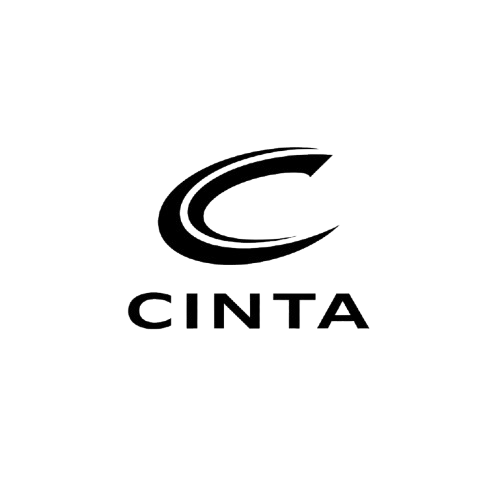

# cinta: ai de voz open-source

    <picture>
        <source media="(prefers-color-scheme: dark)" srcset="Figures/cinta_logo_white.png">
        
    </picture>

## overview

cinta é uma **família de modelos de ia de voz de código aberto de ponta** que inclui modelos de conversão de texto em fala (tts) e de reconhecimento automático de fala (asr)

uma inovação fundamental do cinta é o uso de tokenizadores de fala contínua (acústicos e semânticos) operando a uma taxa de quadros ultrabaixa de **7.5 hz**. esses tokenizadores preservam a fidelidade do áudio de forma eficiente, ao mesmo tempo que aumentam significativamente a eficiência computacional no processamento de sequências longas. o cinta emprega uma estrutura de [difusão next-token](https://arxiv.org/abs/2412.08635), utilizando um large language model (llm) para compreender o contexto textual e o fluxo do diálogo, e um cabeçote de difusão para gerar detalhes acústicos de alta fidelidade

para obter mais informações, demonstrações e exemplos, visite nossa página do projeto

| modelo | peso | quick try |
|--------|------|-----------|
| cinta-asr-7b | [link do hf](https://huggingface.co/microsoft/VibeVoice-ASR) | [playground](https://aka.ms/vibevoice-asr) |
| cinta-tts-1.5b | [link do hf](https://huggingface.co/microsoft/VibeVoice-1.5B) | desativado |
| cinta-realtime-0.5b | [link do hf](https://huggingface.co/microsoft/VibeVoice-Realtime-0.5B) | [colab](https://colab.research.google.com/github/microsoft/VibeVoice/blob/main/demo/vibevoice_realtime_colab.ipynb) |
